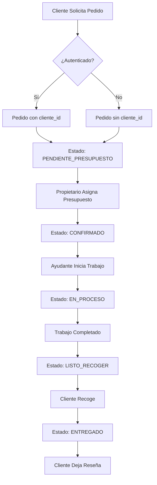

# Documentación Técnica - Confecciones Soledad

## Arquitectura del Sistema

### Stack Tecnológico

```
Frontend:
├── Vue.js 3 (Composition API)
├── Inertia.js 1.0
├── Tailwind CSS 3
└── Vite 5

Backend:
├── Laravel 11
├── PHP 8.2
└── PostgreSQL 14+

Servicios Externos:
└── PagoFácil API (Pagos QR)
```

---

## Modelo de Datos

### Tablas Principales

#### `usuarios` (Users)
```sql
- usuario_id (PK, serial)
- nombre_completo (varchar)
- email (varchar, unique)
- password (varchar)
- rol (enum: PROPIETARIO, AYUDANTE, CLIENTE)
- telefono (varchar, nullable)
- timestamps
```

#### `pedidos` (Orders)
```sql
- pedido_id (PK, serial)
- cliente_id (FK a usuarios, nullable)
- usuario_asignado_id (FK a usuarios, nullable)
- tipo_servicio (enum: ARREGLO, CONFECCION)
- descripcion_prenda (text)
- estado (enum)
- fecha_solicitud, fecha_inicio, fecha_entrega_estimada
- presupuesto_total, costo_real
- notas_adicionales (text)
- timestamps
```

#### `inventario_items` (InventoryItems)
```sql
- item_id (PK, serial)
- nombre (varchar)
- descripcion (text, nullable)
- cantidad_stock (decimal)
- unidad_medida (varchar)
- costo_unitario (decimal)
- timestamps
```

#### `movimientos_inventario` (InventoryMovements)
```sql
- movimiento_id (PK, serial)
- item_id (FK)
- tipo_movimiento (enum: ENTRADA, SALIDA)
- cantidad (decimal)
- motivo (varchar)
- usuario_id (FK)
- timestamps
```

#### `portafolio` (PortfolioItems)
```sql
- portfolio_id (PK, serial)
- titulo (varchar)
- descripcion (text, nullable)
- imagen_url_principal (varchar)
- imagen_url_antes, imagen_url_despues (varchar, nullable)
- publicado (boolean, default true)
- timestamps
```

#### `promociones` (Promotions)
```sql
- promocion_id (PK, serial)
- codigo (varchar, unique)
- descripcion (text, nullable)
- tipo_descuento (enum: PORCENTAJE, MONTO_FIJO)
- valor_descuento (decimal)
- fecha_inicio, fecha_fin (date)
- activa (boolean)
- timestamps
```

#### `pagos` (Payments)
```sql
- pago_id (PK, serial)
- pedido_id (FK)
- monto (decimal)
- metodo_pago (varchar: EFECTIVO, TARJETA, TRANSFERENCIA, QR)
- fecha_pago (date)
- pagofacil_transaction_id, company_transaction_id (varchar, nullable)
- qr_base64 (text, nullable)
- qr_status (varchar, nullable)
- qr_expiration (timestamp, nullable)
- timestamps
```

#### `resenas` (Reviews)
```sql
- resena_id (PK, serial)
- pedido_id (FK)
- cliente_id (FK)
- calificacion (int: 1-5)
- comentario (text,nullable)
- publicada (boolean, default false)
- timestamps
```

#### `visitas_pagina` (VisitaPagina)
```sql
- visita_id (PK, serial)
- pagina (varchar, unique)
- contador (bigint, default 0)
- timestamps
```

---

## Flujos de Negocio

### 1. Flujo de Pedido Completo



### 2. Flujo de Pago con QR

```
1. Admin → Payments → Generar QR
2. PagoFacilService.generateQr(monto, pedidoId)
3. API PagoFácil → Retorna QR Base64
4. Se guarda en BD (qr_base64, qr_status=PENDING)
5. Cliente escanea QR y paga
6. PagoFácil → Callback a /payments/callback
7. Sistema actualiza pago → qr_status=PAID
8. Saldo pedido se reduce
```

### 3. Flujo de Inventario

```
ENTRADA:
- Compra de materiales
- Devolución de proyecto

SALIDA:
- Uso en proyecto
- Desperdicio/Pérdida
```

---

## Controladores Principales

### PublicController
**Rutas:**
- `GET /` - Homepage
- `GET /catalogo` - Catálogo público
- `GET /hacer-pedido` - Formulario pedido
- `POST /hacer-pedido` - Guardar pedido
- `GET /gracias` - Página confirmación
- `GET /nosotros` - About Us

### ClienteController
**Rutas:**
- `GET /mi-cuenta` - Dashboard cliente
- `GET /mis-pedidos` - Lista pedidos
- `GET /mis-pedidos/{id}` - Detalle pedido

### UserController
CRUD de usuarios (solo PROPIETARIO)

### OrderController
CRUD de pedidos (PROPIETARIO + AYUDANTE)

### PaymentController
**Destacado:**
- `POST /payments/generate-qr` - Generación QR PagoFácil
- `POST /payments/callback` - Webhook PagoFácil

### ReportController
**Reportes:**
- Ingresos por periodo
- Costos por periodo
- Rentabilidad
- Pedidos por estado

---

## Componentes Vue Destacados

### Sistema de Temas

**ThemeSelector.vue**
- 3 temas: Niños, Jóvenes, Adultos
- Modo automático día/noche
- Guarda preferencia en `localStorage`

**themes.css**
```css
[data-theme="ninos"] { --color-primary: #FF6B9D; }
[data-theme="jovenes"] { --color-primary: #6366F1; }
[data-theme="adultos"] { --color-primary: #1E3A8A; }

[data-mode="dia"] { --mode-bg-primary: #FFFFFF; }
[data-mode="noche"] { --mode-bg-primary: #111827; }
```

### Accesibilidad

**AccessibilityPanel.vue**
- Tamaño texto: Normal / Grande / Muy Grande
- Alto contraste: ON/OFF
- Botón flotante siempre visible

### Contador de Visitas

**VisitCounter.vue**
- Muestra visitas por página
- Datos compartidos vía Inertia props
- Middleware `ContadorVisitas` incrementa automáticamente

---

## Middleware

### ContadorVisitas
Incrementa contador en cada request GET.

```php
public function handle(Request $request, Closure $next)
{
    if ($request->isMethod('GET')) {
        VisitaPagina::incrementar($request->path());
    }
    return $next($request);
}
```

Registrado en `bootstrap/app.php`.

---

## Servicios Externos

### PagoFacilService

**Métodos:**
- `authenticate()` - Obtiene token
- `generateQr($amount, $orderId)` - Genera QR
- `consultarTransaccion($transactionId)` - Verifica pago

**Configuración (.env):**
```
PAGOFACIL_TOKEN_SERVICE=tu_token_servicio
PAGOFACIL_TOKEN_SECRET=tu_token_secreto
PAGOFACIL_URL=https://serviciostigomoney.pagofacil.com.bo/api
```

---

## Seguridad

### Autenticación
Laravel Breeze + Inertia

### Autorización
- Middleware `auth`
- Políticas por rol en controllers

### CSRF
Tokens automáticos en formularios

### SQL Injection
Eloquent ORM previene inyecciones

---

## Performance

### Optimizaciones Implementadas
- **Lazy Loading**: Imágenes en catálogo
- **Paginación**: Todos los listados
- **Index en BD**: Claves foráneas
- **Vite HMR**: Desarrollo rápido

### Recomendaciones Producción
- Cache de configuración: `php artisan config:cache`
- Cache de rutas: `php artisan route:cache`
- Cache de vistas: `php artisan view:cache`
- OPcache en PHP
- Redis para sesiones/cache

---

## Mantenimiento

### Logs
```bash
tail -f storage/logs/laravel.log
```

### Backups BD
```bash
pg_dump confecciones_soledad > backup_$(date +%Y%m%d).sql
```

### Actualizar Sistema
```bash
git pull
composer install
npm install
npm run build
php artisan migrate
php artisan config:cache
```

---

## Próximas Mejoras Sugeridas

1. ✅ **Menú Dinámico desde BD** (Req #3 pendiente)
2. ✅ **Buscador Global** (Req #9 pendiente)
3. Notificaciones push para clientes
4. Exportación de reportes a PDF/Excel
5. Integración WhatsApp Business API
6. App móvil (React Native + API REST)

---

**Última Actualización:** 22 de Noviembre, 2025
**Versión:** 1.0.0
